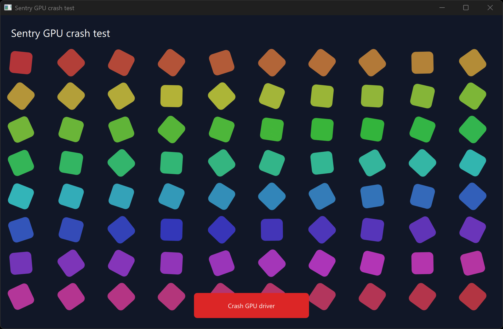

A hardware-accelerated Qt Quick app that injects a fast-fail inside the loaded
user-mode OpenGL driver and triggers it from Qt's render thread, with
sentry-native initialized for capture.

This generates a fast-fail whose instruction address belongs to the driver.
It does not reproduce a driver bug, execute the driver's own failure handling,
or test a driver-created internal thread.

## How it works

When you click **Crash GPU driver**:

1. Qt runs the trigger on its render thread during `beforeSynchronizing`, with
   the OpenGL context current.
2. `wglGetProcAddress("glCreateShader")` resolves an OpenGL entry point. The
   harness identifies its owning module. On the laptop used for local testing,
   this was `igxelpicd64.dll`, Intel's 64-bit user-mode OpenGL driver.
3. `VirtualProtect` makes the entry writable. The harness replaces its first
   two bytes with `CD 29`, the x64 instruction `int 29h`, then restores the memory
   protection and flushes the instruction cache. Only this process's loaded
   copy changes; the DLL on disk stays intact.
4. The harness calls the patched entry with argument `7`:

   ```cpp
   reinterpret_cast<CreateShader>(entry)(FAST_FAIL_FATAL_APP_EXIT);
   ```

   The Windows x64 calling convention puts the first argument in `RCX`.
   `int 29h` reads that register as the fast-fail reason. Together, these behave
   like `__fastfail(7)`, producing `0xC0000409` with reason
   `FAST_FAIL_FATAL_APP_EXIT`.

The exception address is inside the real driver DLL, but none of the original
`glCreateShader` instructions execute. The stack leads back to the trigger on
Qt's render thread.

Windows handles the fatal exception through WER, which should invoke Sentry's
registered WER module for capture. The app sets tags for the OpenGL vendor,
renderer, OpenGL and GLSL version strings, and driver DLL name before the crash.
